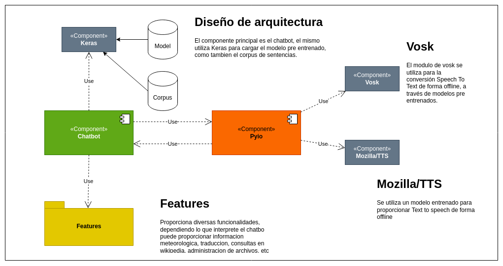

# Asistente virtual keras

Un asistente virtual en python entrenable y customizable.

  


## Contributor

[](https://www.linkedin.com/in/hector-orlando-25124a18a/)


## Tabla de contenido

- [Asistente virtual keras](#asistente-virtual-keras)
  - [Contributor](#contributor)
  - [Tabla de contenido](#tabla-de-contenido)
  - [Descripción](#descripción)
  - [Arquitectura del proyecto](#arquitectura-del-proyecto)
  - [Workflow](#workflow)
      - [Secuencia de Arranque](#secuencia-de-arranque)
  - [Instalación](#instalación)
  - [Uso](#uso)
  - [Licencia](#licencia)
    - [GNU General Public License](#gnu-general-public-license)

## Descripción

Este es un **chatbot**, que incluye una lógica sencilla pero a la vez muy potente. El módulo principal y la lógica principal del mismo se encuentra dentro del script `chatbot.py` ,  este archivo es el core de la aplicación. El mismo desarrolla tres tareas fundamentales apoyandose en el resto de los componentes, la primera es *escuchar*  a través del micrófono. La segunda es la de tomar *decisión* , en base a la entrada del micrófono, el chatbot decodifica la intención del hablante basándose en un modelo entrenado de red neuronal y la tercera es la *responder* segun la decisión tomada, el chatbot puede dar una respuesta usando una voz sintetizada como tambien puede tomar alguna acción dependiendo lo que haya interpretado.


## Arquitectura del proyecto





## Workflow

De acuerdo al diagrama de aquitectura se provee ahora un detalle simplificado del flujo de trabajo del chatbot.

#### Secuencia de Arranque

Cuando se inicia el chatbot, como primera actividad se ejecuta la secuencia de arranque. La misma consiste en crear un corpus o diccionario y entrenarlo, a partir del archivo `intent.json`, este archivo contiene una lista de posibles intenciones, un conjunto de frases que pueden definir una intención, contexto y respuestas para dicha intencion. A continuación se muestra un ejemplo de la estructura de un intent:

```json
    {"tag": "thanks",
     "patterns": ["Thanks", "Thank you", "That's helpful", "Awesome, thanks", "Thanks for helping me"],
     "responses": ["Happy to help!", "Any time!", "My pleasure"],
     "context": ["conversation"]
    }
```

Estos intent son los usandos para entrenar el modelo neuronal que luego procesará el dialogo del usuario.

Con este archivo de intents, el chatbot construirá un corpus con todas las palabras que hay en el. Este corpus se usará para codificar las oraciones del usuario, la técnica utilizada actualmente es **one hot encoding** 

> "One hot encoding" no es una técnica muy eficiente para la codificación del lenguaje natural, pero si cumple con el proposito del chatbot

Además de construir el corpus para el procesamiento del lenguaje natural (**NLP**), en la secuencia de arranque, el chatbot carga el modelo entrenado `model.h5`, que es el modelo que se entrena usando el script `train.py`. Este modelo es el que procesa una oración codificada con `one hot encoding` y determina cual es la intención de fondo que tiene la oración.

Una vez cargada la secuencia de arranque, el chatbot entra en un bucle infinito, dicho bucle contiene el modo escucha, es decir el chatbot esta constantemente escuchando. Cuando escucha una oración por parte del usuario, el modulo de **VOSK** tranforma el audio en texto, y utlizando el corpus este es codificado y procesado por el modelo entrenado de **KERAS**. Una vez determinada la intención, entra en la region de decision, donde se determina si correponde llevar a cabo alguna accion por parte del los distintos **FEATURES** como ser buscar algun texto en la `wikipedia` o si en cambio se debe seleccionar una respuesta adecuada del diccionario de intents.

Para el caso que se debe dar una respuesta, dentro del vector de respuestas para un intent se selecciona una al azar, con lo cual es evita el dialogo lineal. Teniendo una respuesta en modo texto, el modulo de **MOZILLA/TTS** nos provee un sintetizador offline de aceptable calidad y realismo.


## Instalación

Para instalar el proyecto es necesario instalar todos los componentes además de clonar este proyecto, ya que éste recae sobre el uso de otros proyectos.

Este proyecto fue probado en linux, por lo tanto se provee una guia de instalación para el mismo:

1.  Clonar el repositorio:

   ```bash
   git clone https://github.com/hectorcrispens/Asistente-virtual-keras.git
   ```

2. Instalación de Python y Pip

   Este proyecto depende de `python3` y de `pip3`, usualmente el interprete de `python3` viene instalado en las distribuciones `linux` sin embargo a continuación se detalla la forma de instalar ambos componentes:

   ```bash
   sudo apt update
   sudo apt update
   sudo apt install python3-dev python3-pip python3-venv
   
   ```

   Puede obtener mayor información de `Python` en el siguiente [enlace](https://www.python.org/) , para consultas con `Pip`, el gestor de paquetes de `Python` puede hacer click [aqui](https://pypi.org/)

3.  Instalación de `Tensorflow`

   ```bash
   pip3 install --upgrade tensorflow
   ```

4. Instalación de Mozilla/TTS

   El modulo de `Mozilla/TTS` proporciona la posibilididad de sintetizar texto con una calidad bastante aceptable, sin embargo esta librería hace uso de pyaudio para funcionar, con lo cual es importante tener instalado este componente en el sistema operativo.

   ```bash
   sudo apt-get install libasound-dev portaudio19-dev libportaudio2 libportaudiocpp0
   sudo apt-get install ffmpeg libav-tools
   sudo pip install pyaudio
   ```

   Una vez instalado `pyaudio` en el sistema puede consultar la documentación de Mozilla/TTS desde su repositorio en [github](https://github.com/mozilla/TTS)

5. Por ultimo el servicio de `Vosk` que provee speech to text de forma offline utilizando modelos de `red neuronal` pre-entrenados:

   A continuación se provee enlace a la [documentación](https://alphacephei.com/vosk/), para su descarga utilizar `Pip3`

   ```bash
   pip3 install vosk
   ```

## Uso

Para arrancar el script utlizar el siguiente commando:

```bash
python3 chatbot.py
```

y para terminarlo utilizar `ctrl + c`.

## Licencia

Copyright (C) 2021.

- Héctor Orlando,
  - [](https://www.linkedin.com/in/hector-orlando-25124a18a/) [](https://github.com/hectorcrispens) [](mailto:hector.or.cr@gmail.com)

### GNU General Public License

Este programa es software gratuito: puedes redistribuirlo y/o modificar bajo los términos de la Licencia Pública General GNU tal como se publicó por la Free Software Foundation, ya sea la versión 3 de la Licencia, o cualquier versión posterior.

Este programa se distribuye con la esperanza de que sea de utilidad, pero SIN NINGUNA GARANTÍA; sin siquiera la garantía implícita de COMERCIABILIDAD o APTITUD PARA UN PROPÓSITO PARTICULAR. Ver el Licencia pública general GNU para más detalles.

Debería haber recibido una copia de la Licencia Pública General GNU junto con este programa, en [LICENSE.md](http://license.md/) o https://www.gnu.org/licenses/gpl-3.0.html.en.
